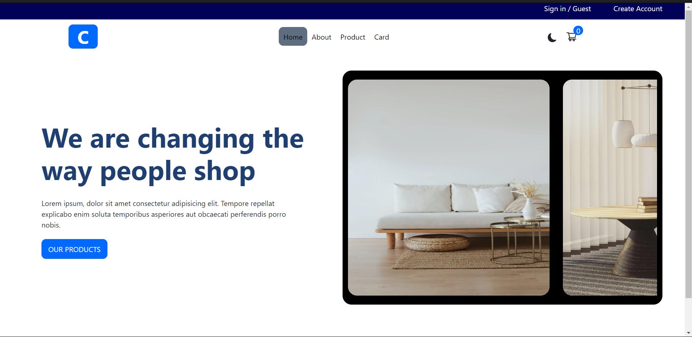

# Project Title

A E-Store with Fake data from Fake Api .

## Table of Contents

- [Project Overview](#project-overview)
- [Features](#features)
- [Technologies Used](#technologies-used)
- [Screenshot](#screenshot)

## Project Overview

Show ow design and contact with backend api although its fake.

## Features

- Feature 1: Buy some stuff from online store.

## Technologies Used

- React: For building the user interface.
- Bootstrap: For styling the UI.

## Screenshot 

